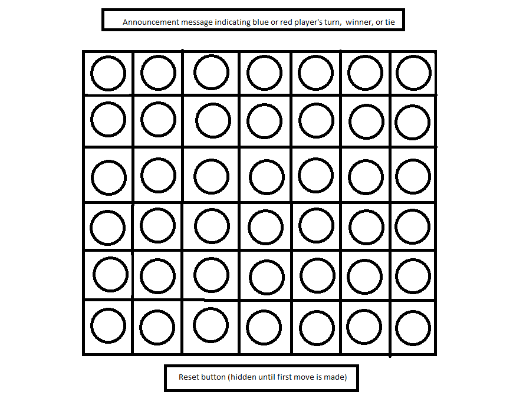

# ConnectFour

In this repository you can play Connect four. Up to two people can play, the starting player being blue, and second player being red. 

The goal of this game is to get four adjacent colors in any direction. Keep in mind the only position you can choose your circle to go in is a column. Once you choose a column, the circle will drop to the lowest unoccupied slot.

## Getting Started

Click [here](https://johnnywiseau141.github.io/ConnectFour/) to start the game. You cannot choose or click occupied slots. You must click an empty slot to drop a circle into a column.

### Technologies Used:

- HTML
- CSS
- Javascript

## Future changes

- Make a shorter and less torturuous winnerIsYou function