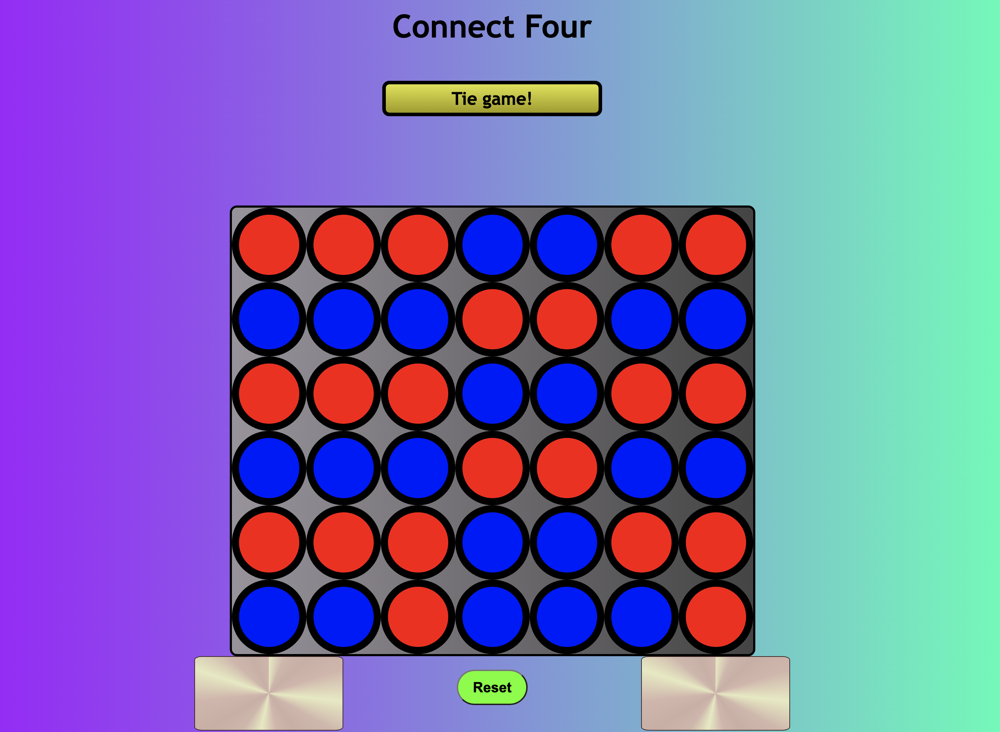

# ConnectFour

In this repository you can play Connect four. Up to two people can play, the starting player being blue, and second player being red. 

The goal of this game is to get four adjacent colors in any direction. Keep in mind the only position you can choose your circle to go in is a column. Once you choose a column, the circle will drop to the lowest unoccupied slot.

## Getting Started

Click [here](https://connect-four-con-lt-dr.surge.sh/) to start the game. You cannot choose or click occupied slots. You must click an empty slot to drop a circle into a column.

### Technologies Used:

- HTML
- CSS
- Javascript

## Future changes

- Place the very large winnerIsYou function in separate js file until a shorter one is written
- Write a shorter and less tedious winnerIsYou function
- Experiment more with styling

## Original High-Level Psuedocode

1) Set variables to represent playerTurn, theWinner, and the boardState

2) Initialization function runs to set all arrays to null, change announcement message telling blue player to go, and sets variable playerTurn = 1, theWinner = false, and boardState set to six arrays in an array, with seven indexes each, all set to null

	- playerTurn is set to 1 or -1 to indicate who’s turn it is.

	- theWinner is set to false to indicate nobody has won, and is set to 1 or -1, depending on the winner being blue or red.

3) Red player goes, changing the announcement message to prompt red player to pick a column, after blue player has run the handleClick function to choose a column to change the index of the bottom array if the index being spliced to is null

4) handleClick function will be used to determine which column the player inserts a circle into, with each column being clicked splices either a 1, or a -1 into the respective element relative to where the circle drops down into.

5) Set a Constant variable for all the win conditions.

6) Set up cached elements for reset button, announcements to players, and boardState

7) Each row should be set up as an array.
	-  When one column is clicked a circle is dropped to the array index, passing each array index as long as each array index is null. 
	- If the index being passed through is not null, then the circle does not pass through and splices the array index above the occupied array index with a value of 1 or -1, depending on if blue player or red player clicked the column

8) Win conditions set up so when a row of four is occupied anywhere on the board, a function is run to determine the absolute value of the sum of the four indexes. 
	
	- Every single win condition needs to be specified— If the absolute value of the row of 4 equals to 4, then it returns any of the indexes, and depending on if the returned value is equal to 1 or -1, determines the winner with an if conditional 	checking if the winner variable is set to 1 or -1. 

9) If theWinner is changed to 1 or -1, the announcement message innerText will be changed to indicate whether red or blue wins

10) if theWinner is set to T, then it’s a tie. It will be set to T if there are no more nulls in all the arrays, and there are no rows adding up to the absolute value of 4.

11) Reset button hidden attribute is removed when handleClick function is invoked. Reset button runs initialization function.

